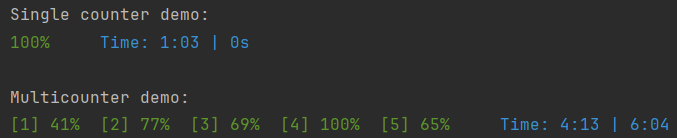

# Progress

This is a simple library for adding one or multiple console progress counter(s) to your project.


### I want to use and/or adapt this project
Go for it - I tried to make everything as readable and modifiable as possible.
Check out the explanation below, and the license in the 'LICENSE' file.
Regardless of the license, it would be cool if you somehow mentioned, that you got this code from here :)

### How to use
1) Add as a library (here shown in IntelliJ) or add the code directly to your project
   
2) Wrap the Object you want to track in `Progresss.of("optional description", someObj)` wherever you want to consume it e.g.
   - You can use it anywhere, where you would use an iterator of a Collection or an Array, since it literally returns one
   - If you don't add a description, an incrementing counter will be added instead
   - ```
     for(Thing t : Progress.of(thingList)) {
         doSomethingWith(t);
     }
     ```
3) You can also register multiple Collections in multiple Threads
4) If you want to reset the counter use `Progress.reset()`
5) You can find more details in the [Demo.java](https://github.com/danielbinder/Progress/blob/master/src/Demo.java)

### Implementation details
- Update rate of the counter is hard coded to 100ms.
- The goal of complicated progress update loop is to reduce IO access as much as possible.
- The progress will be shown as a percentage (int)
- Time is `elapsed time | estimated time left`

### Demo
The [Demo.java](https://github.com/danielbinder/Progress/blob/master/src/Demo.java) demonstrates some usages described above, where the progress is determined by counters that increase randomly.

Here you can see how it should look in your console above.
